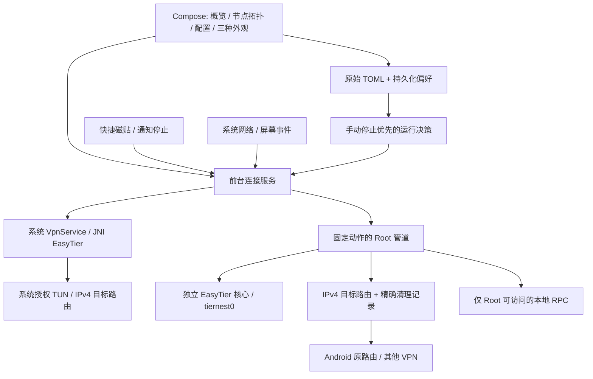

# 独立 App 方案审查与实施记录

## 决定

采用方案 A：原生 Kotlin/Compose App。0.2.0 起支持 Root 核心及无 Root VpnService 两种后端。
现有模块及其通用 arm64 发布政策保持独立，App 不是 WebView 包装或模块伴侣。

## 原方案需要修正的地方

| 原表述 | 修正与实施 |
| --- | --- |
| 换 App 自然更省电，断开“物理级零耗电” | 核心心跳、打洞和网络活动仍耗电。省电来自停止不需要的核心、减少无效唤醒；不能保证整机零耗电。模块已有停止/家庭待机功能。 |
| 息屏后降低打洞频率，亮屏秒恢复 | 没有证据表明上游支持所描述的动态参数。实现可选“停止/重建连接”，默认关闭，明确提示传输中断。 |
| 固定 pref 9000 + table 20110 即完美共存 | 先检测占用再分配，记录精确所有权，部分失败回滚；VPN lockdown、厂商防火墙和 TPROXY 仍需要分别验证。 |
| 强杀所有 easytier 进程、flush 专用表 | 仅处理自身可执行文件与开始时间匹配的 PID，以及自己登记的路由/规则；不碰其他应用资源。 |
| 后台 App 无需常驻组件 | 持续连接及自动待机需要前台服务与通知。手动停止退出服务；事件待机保留小型事件监听。 |
| Modifier.blur 就能实现毛玻璃 | 它会模糊组件自身，不能直接当背景模糊。首版采用低成本分层色面、圆角和独立的澎湃风格配色。 |
| “跟随系统”作为第三种设计系统 | 界面风格（MD3/澎湃）和明暗模式（系统/浅/深）分别设置。 |
| MoonTier 源码可以直接融合 | 包内未找到明确许可证。只参考功能，不复制代码、FFI 库、字体或资源。 |
| 原模块无感转成 App | App 路由与热点能力尚不等价；先完整备份，保留所有原文，对无法等价的选择明确要求用户审阅。 |
| 本地管理端口自然安全 | 上游 RPC 无认证；使用仅 Root 可访问的回环 TCP 规则，普通 App 无法直接读写配置。隔离失败拒绝启动。 |

## 结构

UI 读取和连接维护串行协调，避免晚到的采样把已停止的连接重新显示为在线。
手动停止标记先持久化，排队中的网络回调不能撤销。未支持的配置拒绝启动，
事件源注册/身份识别失败时保持核心运行并显示错误，不改成另一种检测模式。

## 实施情况

- [x] 独立工程、固定依赖、Gradle wrapper、通用 arm64 核心校验与 APK 构建脚本。
- [x] Root 动作白名单、进程身份校验、管道结束回收、精确路由清理及 RPC 隔离。
- [x] 概览与流量曲线、节点/下一跳 RTT、表单与 TOML、双主题及独立明暗设置。
- [x] 前台通知、快捷磁贴、默认关闭的锁屏暂停、默认关闭的开机恢复。
- [x] Wi-Fi 网关身份与物理网络 HTTP 验证，多网络记录、事件/定时检测选择。
- [x] Download 配置备份、模块完整快照、迁移审阅与明确选择。
- [x] JVM 与 Root 回归、Lint、APK 编译、实际 ARM 核心离线配置校验。
- [x] Android 15 模拟器安装、主题与基础页面检查。
- [x] Android 16 redroid 的 ADB Root 后端测试：同版本 x86_64 核心创建真实 TUN，
  目标命中专用表；停止后进程与 TUN 退出、原有策略规则逐字节恢复。
- [ ] 完整 App → Root 管理器 → 核心 → 普通应用 TCP 的 arm64 真机验收。
- [ ] 实际 Clash VpnService、VPN lockdown 与 Root 透明代理分别共存验收。
- [ ] Wi-Fi/移动数据切换、断网、强行停止、杀进程和重启恢复的完整真机矩阵。
- [ ] 拔线待机耗电对照；不以云手机或离线测试替代。

模块导入的 `command_args`、旧路由策略与热点转发保留原文，但不自动解释为等价
App 设置。生产升级前还需补足这些能力或维持明确的人工迁移选择；不能将当前
开发版描述为原模块全部能力的无损替换。

## 验收方法

1. 记录基线进程、`ip rule`、相关路由、VPN 状态；不把网络身份写入公开报告。
2. App 开/关各重复执行，断开后核对 PID、TUN、拥有的路由、RPC hook 与前台服务。
3. 同时运行 Clash 后，用普通 App 测试组网 TCP 与普通互联网；仅 Root ping 成功不算通过。
4. 保持下载时切换 Wi-Fi/移动数据、开关 VPN、锁屏；检查失败提示与恢复耗时。
5. 手动停止后触发网络事件、亮屏及重启，不能自动重新连接。
6. 家庭事件模式持续待机时，不产生重复 HTTP；HTTP 模式验证两次失败恢复与间隔保留。
7. 配置保存失败、Download 不可写和迁移失败时，原文件字节及原服务设置必须保留。
8. 相同设备/网络/时长比较模块持续运行、App 持续运行、自动待机及完全停止；记录
   实际电量、唤醒和网络统计，不用 UI 的状态或 CPU 瞬时值推断续航。

## 依据

- [Android VpnService 限制](https://developer.android.com/develop/connectivity/vpn)：每个用户/配置文件一个活动的 VPN 服务。
- [前台服务类型](https://developer.android.com/develop/background-work/services/fgs/service-types)：本 App 使用 specialUse，并声明实际用途。
- [Android netd 路由实现](https://android.googlesource.com/platform/system/netd/+/refs/heads/main/server/RouteController.cpp)：共存涉及策略路由、网络选择与 UID 规则，不只是网卡名称。
- [EasyTier 2.6.4 源码](https://github.com/EasyTier/EasyTier/tree/v2.6.4)：校验配置、CLI JSON、RPC 及日志参数；许可证为 LGPL-3.0。

MoonTier 本地源码归档已与 NAS 原件校验 SHA-256 一致。私有归档与解压文件未纳入仓库。

## 2026-09-19 验证结果

- 13 项 JVM 测试：停止优先级、事件失败、路由范围/撤回、旧家庭配置读取、CLI 节点
  数据、TOML 保留与危险配置拒绝。14 项 Root 模拟回归：规则冲突、回滚、清理所有权、
  备份字节/唯一名称、PID 复用、符号链接拒绝、RPC 隔离与链冲突。
- Android Lint 无错误，debug APK 构建通过。依赖升级提示保留，不为消除提示盲目升级。
- 包内实际 arm64 核心通过 QEMU 执行 `--version` 与 `--check-config`；确认
  `2.6.4-8428a89d` 接受生成配置、固定 RPC、白名单和轮转日志参数。
- 现有模块 14 项通用升级迁移场景及 Download 备份、家庭检测回归通过。没有改动模块
  运行逻辑或三个公开配置模板。
- Android 15 模拟器：安装启动、MD3 与澎湃风格、强制深色、页面切换检查。
- 用户提供的 Android 16 redroid：App 可安装；普通 App 执行 su 被权限拒绝；
  拒绝授权后显示明确错误、持久化停止状态，前台服务退出且无崩溃。
  `iptables filter` 不可用。仅在独立临时目录、通过 ADB Root 使用同提交 x86_64
  上游核心验证后端；测试路由、进程与 TUN 已清理，原规则恢复。Android 同秒连续备份
  的字节和唯一文件名检查通过，并修复 toybox mktemp 与 GNU 的模板差异。
- redroid 没有安装 Clash；没有据此声称 Clash、真实组网数据传输或整机耗电通过。
  未更改云手机 su 权限、内核模块或系统防火墙，也未把 x86_64 核心加入发布 APK。

## alpha02：设置重做与切页优化

- 视觉参考 [interstellar-proxy](https://github.com/zn0wii/interstellar-proxy)，保留 MIT 许可；
  增加星际外观、静态环境光晕、玻璃卡片和悬浮导航。旧主题选择不被升级改写。
- 借鉴模块的配置分组，补充实例、监听预设、逐条地址编辑、MTU 和受支持的特性开关；
  固定保存操作，更多菜单提供验证、备份、导入、重新加载。损坏 TOML 保留输入，保存
  响应不能覆盖后续草稿。模块特有的路由/热点功能没有做成无效开关。
- 主页面采用 HorizontalPager 并保留邻页，拖动偏移只在图层中读取。点击直接切换，
  子页 180 ms 位移/透明度过渡；减少动态效果使用 120 ms 淡入淡出。
- 导航、草稿与配置分组状态独立于换肤；偏好写盘串行放到 IO 线程，节点 JSON 和路由
  计算放到后台线程。设置页暂停连续采样，已开始的有界 RPC 完整接收后再暂停。
- 默认产物改为 R8 优化、不可调试的 Release 构建，继续使用原测试签名以便覆盖安装。
  这仍是开发验证版，未建立正式发布密钥或上架应用商店。
- 20 项 JVM 回归与 14 项 Root 回归通过；Release Lint、构建、安装与现有配置/偏好
  字节保留检查通过。云手机完成主题切换、节点编辑、监听预设、TOML 同步与草稿测试。
- 初次云手机对照：相同 24 次主导航点击，预热一轮后采样，alpha01 调试版为 278 帧、
  11 个卡顿帧（3.96%）、P99 53 ms；alpha02 优化版为 285 帧、1 个卡顿帧（0.35%）、
  P99 7 ms。这是单台云手机的短时样本，包含构建优化和界面变化，不能推断所有手机
  的固定帧率，也未对 interstellar-proxy 做相同设备的性能比较。

性能实现依据：[Compose 性能实践](https://developer.android.com/develop/ui/compose/performance/bestpractices)。
截图及完整帧记录保留在仓库外；后续实体手机仍需测试手势打断、快速往返和后台联网时的帧时间。

导航定稿后的第二轮同样 24 次点击采样为 282 帧、0 个卡顿帧、P99 6 ms；
这仍是短时云手机样本。另补充地址编辑保留条目额外选项、重复旧 URI 只修改选中行的回归。
滚动设置子页时返回栏固定，减少动态效果往返和主页面手势切换已完成交互检查。

## 0.2.0-alpha03：双模式与路由拓扑

- 新安装默认 VPN；早期安装保留 Root 和原始 TOML。模式切换先停止当前后端，
  VPN 的配置校验、保存和 MediaStore Download 备份不调用 Root。
- JNI 核心从固定 EasyTier 2.6.4 源码编译，arm64 / x86_64 双 ABI，无 TCP 管理端口。
  App UID 从 VPN 中排除，保持底层传输不递归；TUN 更换等待上游接收确认后才释放旧 FD。
- 概览增加模式、当前网络、时长、累计流量与路由；节点页增加详情和实际路由树。
  用节点 ID/地址消歧；未知下一跳、折叠多跳、冲突及子网用虚线标识。
- Hyper 外观接入 Miuix 0.6.1 的 Card、SuperArrow、Switch、TabRow 和 NavigationBar。
  控制台指示块使用参考项目的弹簧（damping 0.85、stiffness 420），颜色过渡 250 ms。
- 25 项 JVM、14 项 Root 回归、Lint 与 Release 构建通过；模块通用升级 14 场景、
  Download 备份、家庭检测与网络恢复回归通过。
- Android 16 x86_64 云手机通过 VPN 授权、真实 TUN 及 P2P 连接；普通独立 App UID
  经组网代理子网收到 HTTP 200，同时物理网络 HTTP 200。未向 TierNest App 授予 Root。
  云容器原先缺少 Android 使用的 `/dev/tun`，测试时临时链接到现有 `/dev/net/tun`。
  该修复属于测试环境，未打包进 App。实体设备耗电与 Root/Clash 验收仍未完成。
